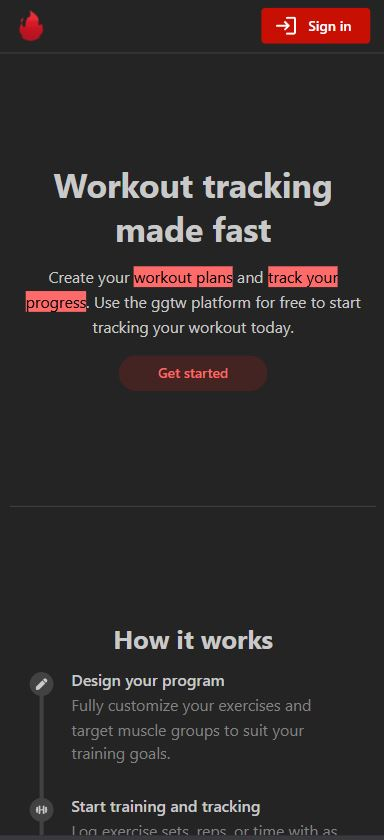
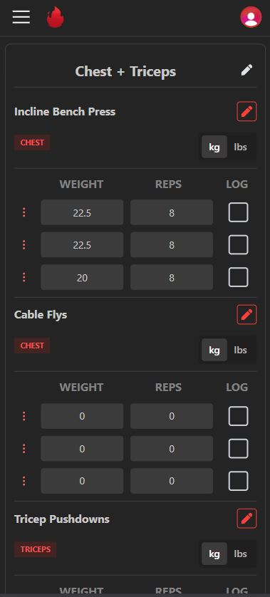

# GGTW

> A workout tracking web-application which displays your statistics and helps you log your workout

## Tech Stack

- MongoDB
- Express.js
- React.js (TypeScript)
- Node.js
- MantineUI components
- TailwindCSS
- Redux state management
- Clerk
- Vitest
- Vercel

## About

Find it deployed here: https://www.ggtw.dev/

  
   

